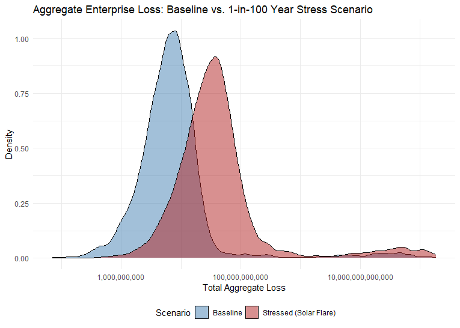

## 2026 SOA Case Study: Alienz Insurance
By: Amelia Chung, Asrith Devarapalli, Ho Yin Lam, Daniel Song, Nathan Tan

# Objective Overview
As part of the collaboration between Galaxy General Insurance Company and Cosmic Quarry Mining Company, our team has been tasked with developing an insurance pricing strategy to best cover the risks of four areas (Business Interruptions, Cargo Loss, Workers' Compensation and Equipment Failure) in three different solar systems: Helionis Cluster, Bayesia System and Oryn Delta.

# Libraries, Data Cleaning, Data Limitations
For our analysis, we utilised the following libraries:
```r
library(readxl)
library(stringr)
library(dplyr)
library(ggplot2)
library(fitdistrplus)
library(MASS)
library(caret)
library(regclass)
library(glmmTMB)
library(DHARMa)
library(gap)
```

The raw historical data used as the basis to price our product contained various data integrity issues such as inconsistent values and wrong data classes, thus cleaning was conducted for each dataset. Following the provided Data Dictionary, each column was checked to ascertain it aligned with the required format and otherwise corrected with the following code snippet:
```r
### Functions to help optimise the code

# Clean issues in IDs. For example, "BI-000093_???5643" -> "BI-000093"
clean_id <- function(x) str_replace(x, "_[?][?][?].*", "") |> str_trim()

#For numeric columns: values that are clearly out of the defined range, are set to NA
#The specific low, high thresholds are specified later when the function is used.
clean_numeric <- function(x, lo = -Inf, hi = Inf) {x[!is.na(x) & (x < lo | x > hi)] <- NA
  x}

#Round integers, and see if they are in the valid levels, or else set as NA
clean_levels <- function(x, valid = 1:5) {
  x_int <- round(as.numeric(x))
  x_int[!x_int %in% valid] <- NA
  x_int}

# Clean the "???" issues in character columns, e.g. "Epsilon_???1063" -> "Epsilon"
clean_charac <- function(x) str_replace(x, "_[?][?][?].*", "") |> str_trim()
```

To deal with NA factors affecting frequency model training, if the proportion of NA values in the dataset was high, median imputation would be applied to the factor and character class data to best maintain central tendency and ensure useful data would not be lost from omission. However, for low proportion of NAs where bias risk would be minimal and imputation would cause reduced variance and distort the distribution, NA value omission was applied instead: 
```r
clean_data <- function(df) {
  char_cols <- sapply(df, is.character)
  df[char_cols] <- lapply(df[char_cols], factor)
  
  factor_cols <- sapply(df, is.factor)
  for (col in names(df)[factor_cols]) {
    mode_val <- names(sort(table(df[[col]]), decreasing = TRUE))[1]
    df[[col]][is.na(df[[col]])] <- mode_val
  } # impute NA factors and characters (numeric handled by caret)
  
  df_clean <- df[!is.na(df$claim_count), ] # remove NA values from target variable
  return(df_clean)
}
```

Moving onto the data limitations, a primary limitation was the historical dataset mismatch of solar systems, with claims data being available for Helionis, Epsilon and Zeta instead of Helionis, Bayesia and Oryn Delta where future operations would occur. To overcome this, a proxy calibration approach was used along with the provided information on each system in the Encyclopedia. Despite the structural similarity however, this approach introduces parameter uncertainty. Therefore, sensitivity testing was done to assess the impact of proxy misspecification on aggregate loss tails and capital requirements. Other limitations included:
- Limited data on extremely correlated solar storm events
- Potential inflation misalignment over long term transit windows in Oryn Delta
- Limited granularity in human capital risk variables

# Product Design
To effectively managage the vastly different risk profiles across Cosmic Quarry's operations, the portfolio is bifurcated into two layers: Tier 1 (Attritional) and Tier 2 (Catastrophic)
- **Tier 1 (Attritional Risk Layer)**: Covers Workers' Compensation (WC) and Equipment Failure (EF), tailored for the high-frequency, low-severity claims characteristic of the Helionis Cluster's high-traffic and high-debris environment.
- **Tier 2 (Catastrophic Risk Layer)**: Covers Business Interruption (BI) and Cargo Loss (CL). This layer focuses on systemic, correlated and totl-loss threats in the Bayesia System and Oryn Delta, where extreme isolation demands unique parametric and agreed-value structures.

Premiums are driven by Generalised Linear Models (GLMs) that isolate predictive operational variables, allowing the rating engine to automatically adjust to the relaties of each system. 

| Product | Primary Rating Variables | System Weighting & Actuarial Justification |
| :--- | :--- | :--- |
| **Workers' Compensation (WC)** | `gravity_level`, `safety_training_index` | **Highest in Helionis (Frequency):** High gravity environments directly inflate the frequency and severity of musculoskeletal claims, demanding heavy premium loading. |
| **Equipment Failure (EF)** | `usage_intensity`, `solar_radiation` | **Highest in Bayesia (Tail Risk):** Radiation spikes cause instantaneous electronic degradation, shifting EF from a predictable wear-and-tear risk to a volatile, heavy-tailed exposure. |
| **Business Interruption (BI)** | `energy_backup_score`, `supply_chain_index` | **Highest in Bayesia/Oryn (Correlation):** Poor backup scores heavily penalise premiums, as a single solar event can trigger simultaneous, system-wide communication and production stoppages. |
| **Cargo Loss (CL)** | `transit_duration`, `vessel_age`, `pilot_exp` | **Highest in Oryn Delta (Severity):** The 240 AU distance and 60-month duration maximise the probability of a total loss, requiring peak risk margins to cover extreme uncertainty. |

To implement this operational design in our model, we established a central sys_params matrix to map environmental constraints directly into the model: 
```r
  # ======
  # STEP 3: Build sys_params
  #
  # Parameters retained from Online Encyclopedia (justified below):
  #   route_risk     : Helionis=3 (erratic debris, micro-collisions),
  #                     Bayesia=2  (heavily mapped, stable orbits),
  #                     Oryn=4     (asymmetric ring, orbital shear)
  #   debris_density : consistent with route_risk ordering
  #   solar_radiation: Helionis G2V low flare=0.50; Bayesia binary EM spikes=0.70;
  #                     Oryn M3V dim/mild=0.30
  #   supply_chain   : Bayesia "well-established orbital stations"=0.75;
  #                     Oryn "infrastructure rapidly evolving"=0.60;
  #                     training medians all ~0.495, so CQ above-median is reasonable
  #   gravity (Bayesia=1.300): directly stated "high-gravity" in encyclopedia
  #   gravity (Helionis=1.125, Oryn=1.113): assumed; flagged below
  # ======
  sys_params <- data.frame(
    cq_system = cq_systems,
    proxy_sys = unname(sys_proxy),
    
    # WC: gravity
    # Bayesia=1.300 encyclopedia-stated ("high-gravity with thin magnetosphere")
    # Helionis=1.125. Oryn=1.113:assumed (no explicit encyclopedia figure); flagged
    gravity      = c(1.125, 1.300, 1.113),
    
    # WC: psych_stress: training-data median per proxy system (replaces assumed 3,4,4)
    psych_stress = as.numeric(get_wc_param("psych_stress_med")),
    
    # Cargo: route_risk: encyclopedia-supported (see note above)
    route_risk_n = c(3L, 2L, 4L),    # numeric for cargo_nb
    route_risk_c = c("3","2","4"),   # character (--> factor) for cargo_glm
    
    # Cargo: debris_density and solar_radiation: encyclopedia-supported
    debris_density  = c(0.60, 0.30, 0.70),
    solar_radiation = c(0.50, 0.70, 0.30),
    
    # Cargo: pilot_exp: training-data median; no system-level breakdown available
    pilot_exp     = as.numeric(pilot_exp_vals[cq_systems]),
    
    # Cargo: vessel_age: training-data median scaled by inventory-derived system maturity
    vessel_age_cq = as.numeric(vessel_age_vals[cq_systems]),
    
    # BI: supply_chain: encyclopedia-supported (see note above)
    supply_chain  = c(0.80, 0.75, 0.60),
    
    # BI: maint_freq: training-data median per proxy system (replaces assumed 4,3,2)
    maint_freq_bi = as.numeric(get_bi_param("maint_freq_med")),
    
    # BI: prod_load: training-data median per proxy system (replaces assumed 0.80,0.75,0.85)
    prod_load     = as.numeric(get_bi_param("prod_load_med")),
    
    # BI: energy_backup: training-data mode per proxy system (replaces assumed all=4)
    #     Helionis=5, Epsilon(Bayesia)=2, Zeta(Oryn)=2
    energy_backup = as.numeric(get_bi_param("energy_bk_mode")),
    
    stringsAsFactors = FALSE
  )
```

# Pricing & Commerical Strategy 
The pricing framework is designed to capture the baseline expected 10-year present value cost while aggressively funding the liquid capital reserves required to survive extreme tail-risk volatility. 

The fundamental pricing equation applied across the portfolio is:
         **Gross Premium = Expected Loss + Cost of Capital + Expenses + Profit Margin**

Because CL represents an extreme capital burden (generating a standard deviation of 38.02 Billion Ð), a uniform pricing approach would critically undercapitalise Galaxy General. Therefore, we propose a **Modular Pricing Structure:**
1. **Core Coverage Package:**Includes BI, WC, and EF. Because these hazards exhibit stable finanical variance, they are priced with a predictable, moderate cost-of-capital margin.
2. **Cargo Loss Coverage (Modular Addition):**Priced separately as an optional or standalone capital module due to its massive tail risk. To optimise costs, this module utilises a layered risk-retention approach
   * Deductible: Policyholders retain an initial 34,000K Ð (5% of max cargo value) to absorb high-frequency attritional damage.
   * Primary Retention: Galaxy General covers severity up to the 680,000K Ð maximum fleet exposure limit.
   * Risk Transfer: Extreme total-loss events are partially transferred via CAT XL and Facultative reinsurance.

**10-year Comprehensive Pricing Structure**
Applying this framework to the fully underwritten comrpehensive portfolio (Core + Cargo) over a 10-year projection yields the following structure:

| Pricing Component | Value (10-Year PV) | Actuarial Rationale |
| :--- | :--- | :--- |
| **Expected Loss** | 90.21 Billion Ð | Baseline 10-year present value cost derived from aggregate Monte Carlo simulations. |
| **Cost of Capital (20%)** | 18.04 Billion Ð | Risk margin dedicated to funding reserves against the 197.97 Billion Ð $VaR_{0.99}$ threshold. |
| **Capital-Adjusted Pure Premium** | 108.25 Billion Ð | The true cost of absorbing Cosmic Quarry's operational risk. |
| **Target Gross Premium** | 166.54 Billion Ð | Factors in a 30% expense ratio (administration/reinsurance) and a 5% corporate profit margin (65% permissible loss ratio). |

**Long-Term Projection Implementation**
To simulate these commerical returns, we projected the portfolio out 10 years, accounting for compounding exposure growth, interplantary inflation and investment float yields. 
```r
  # PRICING, EXPENSE, AND ECONOMIC PARAMETERS
  # ======
  expense_ratio <- 0.30   # 30% of premium for admin, reinsurance, commissions
  profit_margin <- 0.05   # 5% target profit margin
  load_factor   <- 1 / (1 - expense_ratio - profit_margin)  # Yields 1.538 (65% permissible loss ratio)
  
  # Economic Assumptions (5-yr trailing avg 2170–2174)
  inf_fwd   <- 0.0423     # 4.23% Claims inflation rate
  r1yr_fwd  <- 0.0371     # 3.71% Short-term reserve investment rate
  r10yr_fwd <- 0.0376     # 3.76% Long-term discount rate

  # ======
  # 10-YEAR FINANCIAL PROJECTION LOOP
  # ======
  for (t in seq_len(N_YEARS)) {
    
    exp_growth_t  <- (1 + wtd_growth)^(t - 1)    # Exposure multiplier
    inf_factor_t  <- (1 + inf_fwd)^(t - 1)       # Severity inflation multiplier
    disc_factor_t <- 1 / (1 + r10yr_fwd)^t       # PV discount factor
    
    # 1. Expected total loss for year t 
    E_S_t <- total_el_y1 * exp_growth_t * inf_factor_t
    
    # 2. Gross Premium (priced at start of year based on expected loss and load factor)
    P_t   <- E_S_t * load_factor
    
    # 3. Expenses (Deterministic % of premium)
    Exp_t <- P_t * expense_ratio
    
    # 4. Investment Income: 0.5 × E[loss] held as float, earned at short-term rate
    Inv_t <- 0.5 * E_S_t * r1yr_fwd
    
    # --- Simulate aggregate losses (S_t) for each line ---
    # [Simulation execution functions omitted for brevity]
    S_t  <- sim_t_bi + sim_t_wc + sim_t_ef + sim_t_cargo
    
    # 5. Net Revenue Calculation (per simulation)
    NR_t <- P_t + Inv_t - S_t - Exp_t
    
    # Store Present Values
    proj_pv_cost <- proj_pv_cost + S_t  * disc_factor_t
    proj_pv_rev  <- proj_pv_rev  + NR_t * disc_factor_t
  }
```
# Aggregate Loss Modelling
Aggregate annual losses for the four hazard areas (Business Interruption, Cargo Loss, Equipment Failure, and Workers' Compensation) were estimated using an actuarial collective risk model. Generalised linear models with exposure offsets were used to model claim frequency, allowing expected claim counts to scale appropriately with operational exposure. While Poisson regression models were used for BI, EF and WC claims, a negative binomial regression model was used for CL claims to account for overdispersion in shipment incident frequency.
For claim severity, a combination of parametric and regression methods was used. Log-normal distribution was used for BI and WC severities. This reflects the multiplicative nature of operational disruption costs and injury-related expenses. Gamma GLM was used for Equipment Failure and Cargo severities, allowing claim size to adjust with operational characteristics such as usage intensity, cargo weight, environmental conditions, etc.
## Modelling Procedure

In order to model the aggregate loss, we developed an aggregate loss model using a Monte Carlo simulation framework. By modelling and bridging the frequency and severity of claims for each hazard coverage area and running Monte Carlo simulations 10,000 times for each hazard coverage, we acquire a good estimate of the probability distribution of total annual losses. The core of the loss simulation lies in the custom simulation function that we produced shown below.
```r
  # simulate_aggregate(): Collective risk model: S = sum_{i=1..N} X_i
  #
  # mu_pool   : severity mean parameter pool
  #               lnorm --> meanlog (length 1, no covariates for BI/WC)
  #               gamma --> E[X] from predict(glm, type="response") per row
  # lambda    : expected annual claim count (rate × exposure volume)
  # freq_dist : "poisson", "negbin"
  # theta     : NegBin size parameter (required for negbin)
  # prob_w    : sampling weights for mu_pool (NULL = uniform)
  #             EF uses claim-count weights per equipment type
  # sev_dist  : "lnorm", "gamma"
  # sigma     : sdlog (required for lnorm)
  # phi       : Gamma dispersion = summary(model)$dispersion (required for gamma)
  #             Parameterisation: X ~ Gamma(shape=1/phi, scale=phi*mu_i)
  #             so E[X_i]=mu_i and Var[X_i]=phi*mu_i^2
  # scale     : 1e6 for BI (fitted on $millions), 1000 for WC (fitted on $thousands),
  #             1 for EF and Cargo (fitted on raw $)
  
  simulate_aggregate <- function(mu_pool, lambda, N_SIM,
                                 freq_dist = "poisson", theta = NULL,
                                 prob_w    = NULL,
                                 sev_dist  = "lnorm",
                                 sigma     = NULL,
                                 phi       = NULL,
                                 scale     = 1) {
    if (freq_dist == "negbin" && is.null(theta))
      stop("theta is required for negbin simulation")
    if (sev_dist == "lnorm"  && is.null(sigma))
      stop("sigma (sdlog) is required for lognormal simulation")
    if (sev_dist == "gamma"  && (is.null(phi) || phi <= 0))
      stop("phi > 0 is required for gamma simulation")
    
    pool_n   <- length(mu_pool)
    out      <- numeric(N_SIM)
    marginal <- (pool_n == 1L)
    
    for (iter in seq_len(N_SIM)) {
      n <- if (freq_dist == "poisson")
        rpois(1L, lambda)
      else
        rnbinom(1L, mu = lambda, size = theta)
      
      if (n == 0L) { out[iter] <- 0.0; next }
      
      if (sev_dist == "lnorm") {
        ml <- if (marginal) mu_pool[1L] else
          mu_pool[sample.int(pool_n, n, replace = TRUE, prob = prob_w)]
        x  <- rlnorm(n, meanlog = ml, sdlog = sigma)
      } else {
        mu_i <- if (marginal) mu_pool[1L] else
          mu_pool[sample.int(pool_n, n, replace = TRUE, prob = prob_w)]
        x    <- rgamma(n, shape = 1.0 / phi, scale = phi * mu_i)
      }
      
      out[iter] <- sum(x) * scale
    }
    out
  }

```
The following code was used to model the frequency of losses in regards to each coverage area, through Poisson GLMs.
```r
  set.seed(5100)
  train_control <- trainControl(method = "cv", number = 10)
  
  ## Business Interruptions
  bi_clean <- na.omit(bi)
  bi_vars      <- setdiff(names(bi_clean), c("policy_id", "station_id", "claim_count", "X", "exposure"))
  joined_names <- paste(bi_vars, collapse = " + ")
  formula      <- as.formula(paste("claim_count", "~", joined_names, "+ offset(log(exposure))"))
  bi_poisson   <- train(formula,
                        data       = bi_clean,
                        method     = "glm",
                        family     = poisson,
                        trControl  = train_control)
  summary(bi_poisson) # only avg_crew_exp insignificant
  
  ## Cargo
  cargo_clean <- na.omit(cargo)
  cargo_vars   <- setdiff(names(cargo), c("policy_id", "shipment_id", "claim_count", "X", "exposure", "cargo_value"))
  joined_names <- paste(cargo_vars, collapse = " + ")
  formula      <- as.formula(paste("claim_count", "~", joined_names, "+ offset(log(exposure))"))
  cargo_nb     <- train(formula,
                        data      = cargo_clean,
                        method    = "glm.nb",
                        trControl = train_control,
                        tuneGrid  = expand.grid(link = "log"))
  summary(cargo_nb)
  
  ## Equipment Failure
  ef_clean <- clean_data(ef)
  ef_vars      <- setdiff(names(ef), c("policy_id", "equipment_id", "claim_count", "X", "exposure"))
  joined_names <- paste(ef_vars, collapse = " + ")
  formula      <- as.formula(paste("claim_count", "~", joined_names, "+ offset(log(exposure))"))
  ef_poisson   <- train(formula,
                        data       = ef_clean,
                        method     = "glm",
                        family     = poisson,
                        preProcess = c("medianImpute"),
                        na.action  = na.pass,
                        trControl  = train_control)
  summary(ef_poisson) # all significant
  
  ## Workers' Compensation
  wc_clean <- na.omit(wc)
  wc_vars      <- setdiff(names(wc), c("policy_id", "worker_id", "claim_count", "X", "exposure", "station_id"))
  joined_names <- paste(wc_vars, collapse = " + ")
  formula      <- as.formula(paste("claim_count", "~", joined_names, "+ offset(log(exposure))"))
  wc_poisson   <- train(formula,
                        data      = wc_clean,
                        method    = "glm",
                        family    = poisson,
                        trControl = train_control)
  summary(wc_poisson) # all significant except hours_per_week
  
```
The following code was used to model the severity of losses in regards to each coverage area, using various methods, including parametric modelling and Gamma GLMs.
```r
  ### Business Interruption: marginal lognormal (fitted on $millions)
  fit_bi_ln <- fitdist(bi_sev$claim_m, "lnorm")
  summary(fit_bi_ln)
  
  ### Cargo Loss: Gamma GLM
  cols_for_model  <- c("claim_amount", "cargo_type", "cargo_value", "weight",
                       "route_risk", "distance", "transit_duration", "vessel_age",
                       "debris_density", "pilot_experience", "container_type", "solar_radiation")
  cargo_sev_complete <- na.omit(cargo_sev[, cols_for_model])
  cargo_glm_full     <- glm(claim_amount ~ ., data = cargo_sev_complete, family = Gamma(link = "log"))
  print(summary(cargo_glm_full))
  
  cargo_glm <- step(cargo_glm_full, direction = "backward", trace = 0)
  print(summary(cargo_glm))
  # Significant covariates: cargo_type + cargo_value + weight + route_risk + debris_density + solar_radiation
  
  ### Equipment Failure: Gamma GLM
  # Note: equipment_age intentionally excluded to prevent massive row deletion
  cols_for_ef    <- c("claim_amount", "equipment_type", "solar_system", "maintenance_int", "usage_int")
  ef_sev_complete <- na.omit(ef_sev[, cols_for_ef])
  ef_glm_full     <- glm(claim_amount ~ ., data = ef_sev_complete, family = Gamma(link = "log"))
  
  ef_glm <- step(ef_glm_full, direction = "backward")
  print(summary(ef_glm))
  # Significant covariates: equipment_type + solar_system + usage_int
  
  ### Workers' Compensation: marginal lognormal (fitted on $thousands)
  fit_wc_ln <- fitdist(wc_sev$claim_amt_scaled, "lnorm")

```
The modelled hazard profile for each coverage area is as follows:

| Hazard Coverage Profiles   | CoverageDistribution Shape    | Mean           | P99      | Key Frequency Drivers                                             |
| :------------------------- | :---------------------------- | :------------- | :------- | :---------------------------------------------------------------- |
| Business Interruption (BI) | Moderately right-skewed       | 4.32M Ð        | 10.87M Ð | energy\_backup\_score, maintenance\_freq                          |
| Cargo Loss (CL)            | Highly heavy-tailed           | Median 6.51B Ð | 30.82B Ð | route\_risk, debris\_density, solar\_radiation, pilot\_experience |
| Equipment Failure (EF)     | Light-tailed (normal-leaning) | 60.68M Ð       | 66.70M Ð | Equipment type (ReglAggregators), Helionis Cluster location       |
| Workers' Compensation (WC) | Light-tailed                  | 2.62M Ð        | 3.44M Ð  | Occupation type, accident history                                 |

## Stress Testing

To stress test an extreme 1-in-100-year scenario and assess severe tail risks quantitatively, we developed a deterministic extreme scenario: the Carrington-class coronal mass ejection. Rather than assuming hazard areas operate independently, this scenario tests the portfolio's resilience when multiple solar systems and coverage lines fail simultaneously—a compounding, system-wide shock.

### The Scenario Profile

A massive, unpredictable solar flare erupts, sending a wave of electromagnetic and particle radiation across all mining territories.

| Solar System | Impact |
| :--- | :--- |
| **Bayesia System** | Already vulnerable to sharp, temporary spikes of electromagnetic radiation - the system suffers catastrophic grid overloads. |
| **Oryn Delta** | The dwarf star's sporadic, unpredictable flares neutralise the newly deployed amplified beacons and mobile relay drones, causing a system-wide communication blackout. |
| **Helionis Cluster** | While physically shielded from the worst of the radiation, the system suffers severe supply-chain bottlenecks as all transit routes are grounded. |

---

### Modelling the Financial Shock

Baseline model parameters were shocked to simulate this 1-in-100-year event across 10,000 Monte Carlo simulation trials.

| Shock Type | Mechanism | Effect |
| :--- | :--- | :--- |
| **Frequency Multipliers** *(The Domino Effect)* | Aggressive hazard loadings applied to expected claim counts. | The electromagnetic surge causes immediate, widespread Equipment Failures (EF), which in turn trigger an unprecedented volume of Business Interruption (BI) claims as mining extraction halts across Bayesia and Oryn Delta. |
| **Severity Multipliers** *(The Response Delay)* | Expected severity of claims shocked across all coverages. | Communication networks are jammed, severely delaying emergency response and repair crews - a minor Workers' Compensation injury or routine cargo route delay rapidly escalates into a maximum-limit total loss due to the inability to deploy medical or mechanical support. |

These stress tests were done using the following code:
```r
  # 1. Define the Shock Multipliers based on qualitative risk assessment
  # Helionis is shielded but suffers supply chain shocks. Bayesia/Oryn get hit directly.
  freq_shocks <- c("Helionis Cluster" = 1.25, "Bayesia System" = 3.50, "Oryn Delta" = 3.00)
  sev_shocks  <- c("Helionis Cluster" = 1.15, "Bayesia System" = 2.50, "Oryn Delta" = 2.00)
  
  # Initialize lists to hold the stressed simulation results
  bi_sim_stress <- list()
  wc_sim_stress <- list()
  ef_sim_stress <- list()
  cargo_sim_stress <- list()
  
  for (sys in cq_systems) {
    # Extract specific system shocks
    f_shock <- freq_shocks[sys]
    s_shock <- sev_shocks[sys]
    
    # --- BI STRESS ---
    # Lognormal adjustment: add log(severity_shock) to meanlog
    bi_sim_stress[[sys]] <- simulate_aggregate(
      mu_pool = bi_meanlog + log(s_shock), 
      lambda = bi_lambda[sys] * f_shock, 
      N_SIM = N_SIM, freq_dist = "poisson", sev_dist = "lnorm", sigma = bi_sdlog, scale = 1e6
    )
    
    # --- WC STRESS ---
    wc_sim_stress[[sys]] <- simulate_aggregate(
      mu_pool = wc_meanlog + log(s_shock), 
      lambda = wc_lambda[sys] * f_shock, 
      N_SIM = N_SIM, freq_dist = "poisson", sev_dist = "lnorm", sigma = wc_sdlog, scale = 1000
    )
    
    # --- EF STRESS ---
    # Gamma adjustment: multiply mu_pool by severity_shock
    rows <- ef_inventory[ef_inventory$cq_system == sys, ]
    lam_sys_stressed <- sum(rows$row_exp_n) * f_shock
    prob_w <- rows$row_exp_n / sum(rows$row_exp_n) # Weights remain proportional
    
    ef_sim_stress[[sys]] <- simulate_aggregate(
      mu_pool = rows$mu_sev * s_shock, 
      lambda = lam_sys_stressed, 
      N_SIM = N_SIM, freq_dist = "poisson", prob_w = prob_w, sev_dist = "gamma", phi = phi_ef
    )
    
    # --- CARGO STRESS ---
    cargo_sim_stress[[sys]] <- simulate_aggregate(
      mu_pool = cargo_mu_pool[[sys]] * s_shock, 
      lambda = cargo_lambda[sys] * f_shock, 
      N_SIM = N_SIM, freq_dist = "negbin", theta = cargo_theta, sev_dist = "gamma", phi = phi_cargo
    )
  }
  
  # 2. Aggregate the Stressed Enterprise Loss
  enterprise_stress <- Reduce("+", bi_sim_stress) + Reduce("+", wc_sim_stress) + 
    Reduce("+", ef_sim_stress) + Reduce("+", cargo_sim_stress)
  
  # 3. Compare Baseline vs Stressed
  baseline_mean <- mean(full_portfolio)
  baseline_p99  <- quantile(full_portfolio, 0.99)
  
  stress_mean <- mean(enterprise_stress)
  stress_p99  <- quantile(enterprise_stress, 0.99)
  
  cat(sprintf("Baseline Expected Loss: %s\n", formatC(baseline_mean, format="f", big.mark=",", digits=0)))
  cat(sprintf("Baseline 1-in-100 (P99): %s\n", formatC(baseline_p99, format="f", big.mark=",", digits=0)))
  cat("--------------------------------------------------\n")
  cat(sprintf("STRESSED Expected Loss: %s\n", formatC(stress_mean, format="f", big.mark=",", digits=0)))
  cat(sprintf("STRESSED 1-in-100 (P99): %s\n", formatC(stress_p99, format="f", big.mark=",", digits=0)))
  
```
Running the shocked parameters through 10,000 simulation trials produced a massive tail shift in the aggregate loss distribution. The stressed P99 extends drastically beyond baseline expectations, indicating that Galaxy General Insurance Company cannot rely on standard operational cash flow to cover this delta.
<p align="center">
  
  <br>
  <em>Figure 1: Comparison of aggregate loss distribution between baseline and extreme stressed-scenario</em>
</p>

# Risk Assessment

This section evaluates the portfolio's threat landscape through a comprehensive Enterprise Risk Management framework. It categorizes risks by individual solar system profiles, models systemic correlated threats, and outlines financial stress testing alongside ESG integration.


|                             | **Helionis Cluster**                                                                                                                                                                                            | **Bayesia System**                                                                                                                                                                           | **Oryn Delta**                                                                                                                                                                                                                                             |
| :-------------------------: | :-------------------------------------------------------------------------------------------------------------------------------------------------------------------------------------------------------------: | :------------------------------------------------------------------------------------------------------------------------------------------------------------------------------------------: | :--------------------------------------------------------------------------------------------------------------------------------------------------------------------------------------------------------------------------------------------------------: |
| **Profile**                 | High-Traffic Frequency Hub                                                                                                                                                                                      | Radiative Tail Risk                                                                                                                                                                          | Severity Frontier                                                                                                                                                                                                                                          |
| **Proxy**                   | \-                                                                                                                                                                                                              | Epsilon                                                                                                                                                                                      | Zeta                                                                                                                                                                                                                                                       |
| **Operational & Financial** | Two asteroid clusters create localised debris\_density (1.13g gravity), driving high-frequency attritional EF and WC claims. Pilot\_experience and vessel\_age are primary actuarial predictors for CL severity | solar\_radiation index acts as a catastrophic system-wide trigger - causing instantaneous "electronic degradation". EF claims leap from \~15K baseline to 700K+ during high-radiation events | Distances up to 240 AU and 60-month transit durations introduce severe economic risk. 2.5% interplanetary inflation compounds claim costs by 13.1% per transit. Severe collisions maximise the \~680,000K insured limit with virtually zero salvage margin |
| **Strategic**               | Severe concentration risk - up to 85% of BI losses cluster around just two high-density transit routes                                                                                                          | Correlated radiation events impact multiple station\_id locations simultaneously, neutralising geographic diversification benefits                                                           | Rapid expansion outpaces safety governance - safety\_training\_index of only 2.8/5, dramatically elevating WC risks                                                                                                                                        |


---

**Correlated Scenarios & Financial Stress Testing**
While risks are assessed locally, systemic drivers can cause multi-system contagion:
* **Worst-Case Correlated Shocks:** Events like an Interstellar Solar Storm or an Interplanetary Supply Chain Collapse (due to an asteroid fragmentation surge in Helionis) can simultaneously trigger Equipment Failure (EF), Business Interruption (BI), and Cargo Loss (CL) across all territories.
* **Scenario Testing Outcomes:** Attritional and moderate events remain within capital tolerance thresholds. However, worst-case correlated scenarios produce a 1-in-100-year tail amplification that materializes significant capital strain, requiring reinsurance attachments to prevent a solvency breach.

---

**Top Enterprise Threats & Mitigation Strategy**
Based on the threat matrix, the top three critical risks require tailored reinsurance interventions:
1.  **Interstellar Solar Storm (Extreme Tail Risk):** A rare, portfolio-wide contagion event demanding CAT XL reinsurance and parametric BI triggers.
2.  **Deep Space Total Cargo Loss (Catastrophic Severity):** A low-frequency but maximum-limit event in Oryn Delta requiring bespoke Facultative Reinsurance and dynamic inflation adjustments. 
3.  **Asteroid Fragmentation Surge (Operational Contagion):** An attritional event in Helionis requiring quota share proportional reinsurance to maintain cash flow.

---

**ESG Integration**
To ensure long-term sustainability, rigorous ESG incentives are embedded into the pricing algorithm. The portfolio applies dynamic experience rating credits to operations that actively avoid high-debris zones, maintain top-tier safety training scores, and enforce proactive maintenance schedules.

# Conclusion
The "Integrated Interstellar Portfolio" developed for Galaxy General presents a robust, data-driven pricing and risk management framework tailored to the unique operational realities of Cosmic Quarry. By leveraging advanced proxy calibration and Generalised Linear Models, we successfully quantified the disparate risk profiles across the Helionis Cluster, Bayesia System, and Oryn Delta, bridging the gap between historical proxy data and future frontier operations.

Recognising the severe tail risk introduced by deep-space logistics—specifically the massive capital burden of Cargo Loss in Oryn Delta and the correlated contagion of solar storms in Bayesia—our modular pricing structure isolates volatility. It ensures immediate liquidity for attritional claims while aggressively funding capital reserves for 1-in-100-year catastrophic events.

Furthermore, the integration of a comprehensive Enterprise Risk Management (ERM) framework, supported by targeted reinsurance strategies and dynamic ESG premium credits, protects the portfolio against insolvency. Ultimately, this actuarial approach not only accurately prices the extreme uncertainties of interstellar mining but transforms them into a sustainable, profitable commercial venture for Galaxy General Insurance Company.

The information presented on this page is a summary to the complete case study report. The detailed original report can be accessed [here](Alienz-Insurance-Report.pdf)